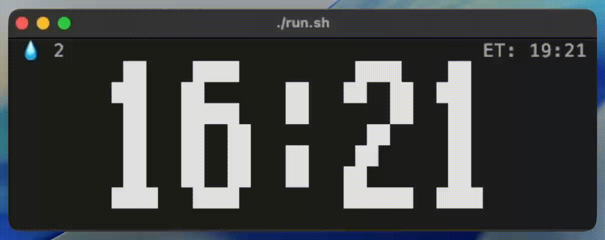

# desktop clock

MacOS doesn't ship with a big enough clock that's visible or legible, nor any plugins/widgets that are sufficient. 
Online options are outdated, just as bad.

Introducing the desktop clock:

- Blinks every 30m to remind you of your mortality (also check your calendar there may be a meeting)
- Goes full cyan-background to remind you to drink water every 15 minutes, you click to say "I drank water" - it counts those in .water_stats.

